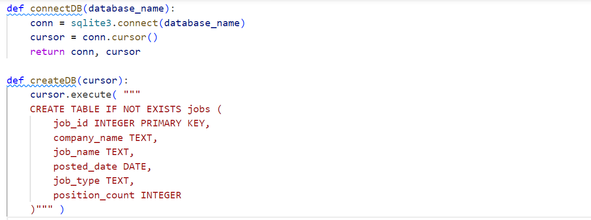
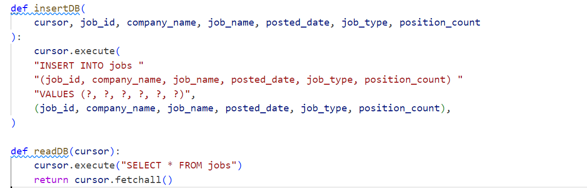
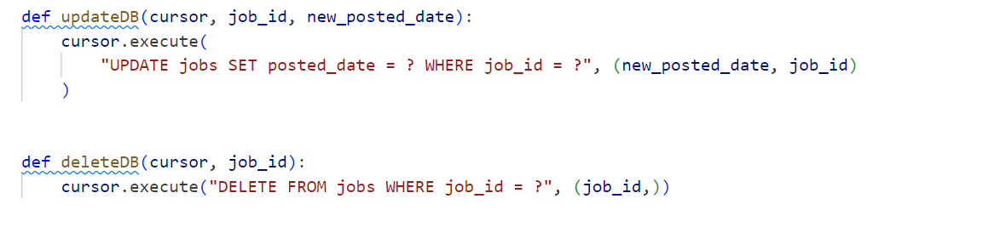
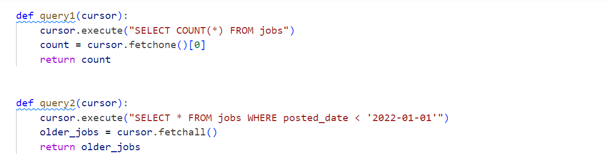
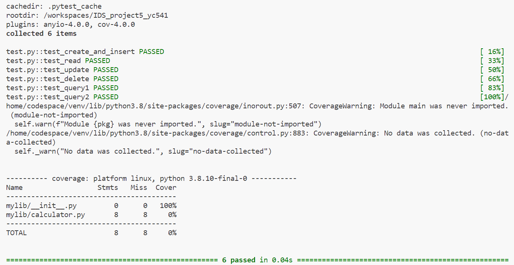
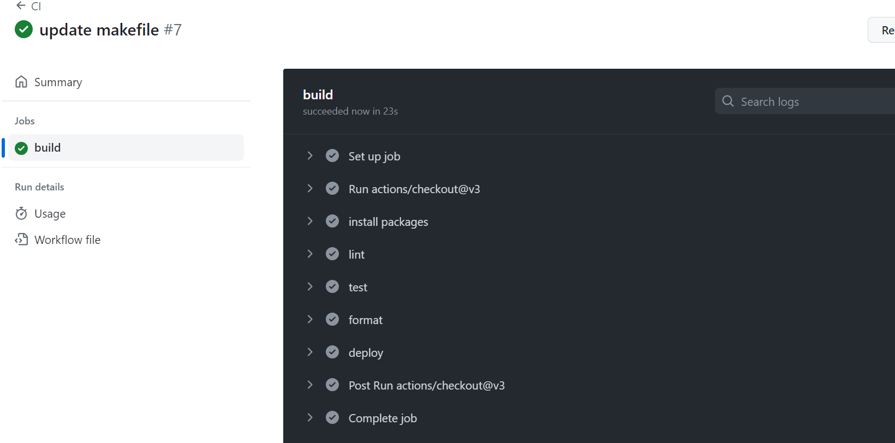

# Week 5: Python Script interacting with SQL Database： Jobs Database Project

This project provides a simple interface to interact with a jobs database using SQLite.

## Functions

### 1. `connectDB and createDB`
Connects to the given SQLite database.
Creates the jobs table if it doesn't already exist.

### 2. `insertDB and readDB`
Inserts a new job record into the jobs table.
Reads all job records from the jobs table.

### 3. `updateDB and deleteDB`
Updates the `posted_date` of a job record based on `job_id`.
Delete some data

### 4. `query1 and query2`
Counts the number of job records in the jobs table.
Fetches job records that were posted before '2022-01-01'.

## Getting Started
To run the project:
1. Install the required packages: `pip install -r requirements.txt`
2. Execute the main script: `python your_script_name.py`

## Testing
Run the tests using: `make test`

## Linting & Formatting
Lint and format the code using: `make lint` and `make format`

## Test result and Action Result
passed all testcases 

the action is built successfully

